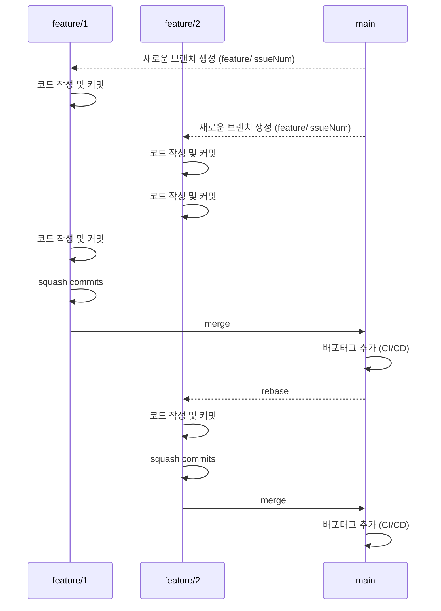

# Overview

이을 LAB 개발팀의 협업 전략을 명시합니다.

- [브랜치 관리 전략](#브랜치-관리-전략)
- [커밋 규칙](#커밋-규칙)

# 브랜치 관리 전략

* 브랜치 관리 전략은 `Github Flow`를 따른다.
* `main` 브랜치는 항상 배포 가능한 상태를 유지한다.
* `main` 브랜치가 변경되면 각각 `feature`는 변경사항을 리베이스한다.
* `main` 브랜치에 merge 하기 전에 커밋을 하나로 합친다(squash commits)

# 커밋 규칙

asdf
