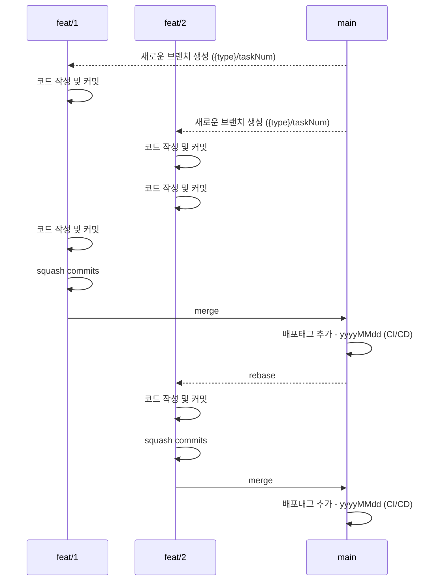

# Overview

이을 LAB 개발팀의 협업 전략을 명시합니다.

- [브랜치 관리 전략](#브랜치-관리-전략)
    - [브랜치 관리 및 커밋 규칙](#브랜치-관리-및-커밋-규칙)
        - [브랜치 네이밍 포맷](#브랜치-네이밍-포맷)
        - [커밋 포맷](#커밋-포맷)
    - [배포하기 전에 배포 태그 추가하기](#배포하기-전에-배포-태그-추가하기)

# 브랜치 관리 전략



* 브랜치 관리 전략은 `Github Flow`를 따른다.

## 브랜치 관리 및 커밋 규칙

* `1 Task` = `1 Branch`
* `main` 브랜치는 항상 배포 가능한 상태를 유지한다.
* `main` 브랜치가 변경되면 각각 `작업 브랜치`는 변경사항을 리베이스한다.
* `main` 브랜치에 merge 하기 전에 커밋을 하나로 합쳐야 한다. (squash commits)

### 브랜치 네이밍 포맷

```
type/num
```
- `feat`
- `fix`
- `docs`
- `style`
- `refactor`
- `test`
- `chore`

각자 로컬에서 쉽게 작업 내용을 식별할 수 있는 형태로 브랜치를 생성한다.

#### 브랜치 생성 예시

- Task 번호: `EUL-1`
- 작업 내용: 게시판 기능 구현인 경우 아래와 같은 형태로 자유롭게 브랜치 네이밍
```
feat/1
feat/1_board
feat/1_board_api
```

### 커밋 포맷

```
type : (task) subject

- body
```
커밋 타입은 브랜치 타입과 동일하다.

#### 커밋 예시

- Task 번호: `EUL-1`
- 작업 내용: 게시판 기능 구현
```
feat : (EUL-1) 게시판 기능 구현

- xxxxx
```

## 배포하기 전에 배포 태그 추가하기

- `main` 브랜치 배포 시 배포 `tag`를 추가한다.
- 배포 태그는 배포 당일 일자로 한다.

### 배포 태그 예시
```
20250808
```
